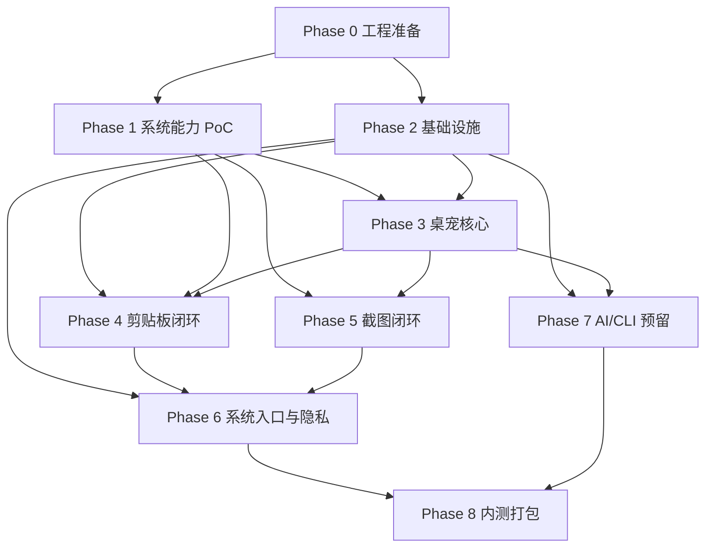

# GoBuddy MVP 开发任务拆解与里程碑

## 1. 目标

本文档用于把 GoBuddy 从“产品原型与技术设计”推进到“可执行开发计划”。MVP 的目标不是一次性完成完整 AI 桌宠，而是先交付一个稳定、轻量、可扩展的 Windows 桌面宠物效率助手：

- 桌宠可见、可拖拽、可与鼠标和系统事件互动。
- 剪贴板历史可自动记录、检索、收藏、恢复。
- 截图能力可通过快捷键或宠物入口触发。
- 托盘、全局快捷键、设置、隐私规则具备基础闭环。
- AI/CLI 能力先完成前端预留、Provider 探测、权限模型与 mock 流程，真实执行延后。

## 2. 开发原则

1. 先验证系统边界，再堆功能。
2. 桌宠主体验不能被工具面板拖慢。
3. 本地优先，默认不上传用户剪贴板、截图、路径和命令内容。
4. AI/CLI 接入必须先有权限、审计、上下文隔离，再开放真实执行。
5. 所有系统能力都要有降级方案。

## 3. 阶段总览

| 阶段 | 名称 | 目标 | 主要产物 |
| --- | --- | --- | --- |
| Phase 0 | 设计冻结与工程准备 | 固化 MVP 范围，创建工程骨架 | solution、项目结构、基础 CI/测试 |
| Phase 1 | 系统能力 PoC | 验证 Windows 关键能力可行性 | PoC 程序、验证记录 |
| Phase 2 | 基础设施 | 完成事件、存储、配置、日志 | Core service、SQLite、settings |
| Phase 3 | 桌宠核心 | 完成桌宠窗口、状态机、动作交互 | PetWindow、PetStateMachine、动画资源 |
| Phase 4 | 剪贴板闭环 | 完成历史记录和恢复 | ClipboardService、历史面板 |
| Phase 5 | 截图闭环 | 完成区域截图和保存/复制 | ScreenshotOverlay、CaptureService |
| Phase 6 | 系统入口收敛 | 完成托盘、热键、设置和隐私 | Tray、Hotkey、Settings、Privacy |
| Phase 7 | AI/CLI 预留 | 完成 Provider 探测和 mock 权限流 | Agent 面板、Provider 状态、任务草稿 |
| Phase 8 | 内测打包 | 可安装、可回滚、可诊断 | 安装包、QA 清单、已知问题 |

## 4. 工作包拆解

### Phase 0：设计冻结与工程准备

| ID | 任务 | 优先级 | 依赖 | 输出 | 验收标准 |
| --- | --- | --- | --- | --- | --- |
| M0-01 | 创建 .NET solution | P0 | 无 | `GoBuddy.sln` | 可在本机 restore/build |
| M0-02 | 创建项目分层 | P0 | M0-01 | `GoBuddy.App`、`GoBuddy.Core`、`GoBuddy.Infrastructure`、`GoBuddy.Tests` | UI、领域、系统能力、测试边界清晰 |
| M0-03 | 接入 DI Host 与日志 | P0 | M0-02 | Host bootstrap、Serilog 或同类日志 | App 启动时可以注入服务并写入本地日志 |
| M0-04 | 建立基础测试规范 | P1 | M0-02 | 单元测试项目、命名规范 | 至少一个 Core 测试可运行 |

### Phase 1：系统能力 PoC

| ID | 任务 | 优先级 | 依赖 | 输出 | 验收标准 |
| --- | --- | --- | --- | --- | --- |
| M1-01 | 透明置顶窗口 PoC | P0 | M0-01 | 小型透明窗口 demo | 透明背景、置顶显示、不会抢焦点 |
| M1-02 | 鼠标命中与穿透 PoC | P0 | M1-01 | alpha hit-test demo | 透明区域不挡鼠标，实体区域可交互 |
| M1-03 | 多屏拖拽与位置恢复 PoC | P0 | M1-01 | monitor-aware placement | 重启后回到合理屏幕位置 |
| M1-04 | 剪贴板监听与恢复 PoC | P0 | M0-01 | clipboard monitor demo | 监听文本/图片，恢复不造成无限循环 |
| M1-05 | 截图 overlay PoC | P0 | M0-01 | 全屏遮罩选区 demo | 多屏坐标正确，选区截图清晰 |
| M1-06 | 全局快捷键 PoC | P1 | M0-01 | hotkey demo | 注册失败时可提示并降级 |
| M1-07 | CLI Provider 探测 PoC | P1 | M0-01 | provider probe demo | 可识别 Codex CLI / Claude Code CLI 是否存在 |

### Phase 2：基础设施

| ID | 任务 | 优先级 | 依赖 | 输出 | 验收标准 |
| --- | --- | --- | --- | --- | --- |
| M2-01 | 实现 EventBus | P0 | M0-02 | `IEventBus` | 服务间可发布订阅事件 |
| M2-02 | 实现 SettingsService | P0 | M0-03 | `settings.json` 读写 | 配置可保存、读取、迁移默认值 |
| M2-03 | 实现 SQLite 存储层 | P0 | M0-02 | migrations、repository | 剪贴板记录可持久化 |
| M2-04 | 实现隐私规则模型 | P0 | M2-02 | `PrivacyRule`、匹配器 | 可排除密码、隐私窗口、指定 app |
| M2-05 | 实现日志与诊断导出 | P1 | M0-03 | log 文件、诊断包 | 内测问题可定位 |

### Phase 3：桌宠核心

| ID | 任务 | 优先级 | 依赖 | 输出 | 验收标准 |
| --- | --- | --- | --- | --- | --- |
| M3-01 | 实现 PetWindow | P0 | M1-01、M1-02 | 透明置顶桌宠窗口 | 桌宠可显示、拖拽、置顶、不过度遮挡 |
| M3-02 | 实现 PetStateMachine | P0 | M2-01 | 状态机服务 | idle、hover、drag、notify、thinking、sleep 可切换 |
| M3-03 | 实现动画资源加载 | P0 | M3-02 | manifest loader、fallback | 资源缺失时回退到默认动作 |
| M3-04 | 实现鼠标交互动作 | P0 | M3-01、M3-02 | 摸头、戳、拖拽、贴边、唤醒 | 动作有反馈，打断规则符合设计 |
| M3-05 | 实现宠物气泡与快捷菜单 | P1 | M3-01 | bubble、radial/menu | 可打开剪贴板、截图、设置、AI 面板 |

### Phase 4：剪贴板闭环

| ID | 任务 | 优先级 | 依赖 | 输出 | 验收标准 |
| --- | --- | --- | --- | --- | --- |
| M4-01 | 实现 ClipboardService | P0 | M1-04、M2-03 | 剪贴板监听服务 | 文本、图片记录稳定写入 |
| M4-02 | 实现去重与来源识别 | P0 | M4-01、M2-04 | hash、source app | 重复复制不刷屏，隐私规则生效 |
| M4-03 | 实现剪贴板历史面板 | P0 | M4-01 | 列表、搜索、筛选 | 可搜索、复制回剪贴板 |
| M4-04 | 实现收藏、删除、清空 | P1 | M4-03 | item actions | 数据操作可撤销或有确认 |
| M4-05 | 实现宠物剪贴板反馈 | P1 | M3-02、M4-01 | notify 动作 | 复制成功时宠物有轻量反馈 |

### Phase 5：截图闭环

| ID | 任务 | 优先级 | 依赖 | 输出 | 验收标准 |
| --- | --- | --- | --- | --- | --- |
| M5-01 | 实现 ScreenshotOverlay | P0 | M1-05 | 多屏选区遮罩 | 选区流畅，坐标准确 |
| M5-02 | 实现截图保存与复制 | P0 | M5-01 | CaptureService | 可复制到剪贴板、保存到本地 |
| M5-03 | 实现截图入口 | P0 | M3-05、M5-01 | 宠物菜单、快捷键入口 | 两种入口均可触发 |
| M5-04 | 实现截图后的动作反馈 | P1 | M3-02、M5-02 | success/fail 状态 | 成功和失败反馈明确 |

### Phase 6：系统入口、设置与隐私

| ID | 任务 | 优先级 | 依赖 | 输出 | 验收标准 |
| --- | --- | --- | --- | --- | --- |
| M6-01 | 实现 TrayService | P0 | M0-03 | 托盘图标与菜单 | 可打开主面板、设置、退出 |
| M6-02 | 实现 HotkeyService | P0 | M1-06 | 全局快捷键管理 | 冲突可提示，支持重新绑定 |
| M6-03 | 实现 Settings UI | P0 | M2-02 | 设置页 | 可配置宠物、剪贴板、截图、快捷键 |
| M6-04 | 实现 Privacy UI | P0 | M2-04 | 隐私设置页 | 可开关剪贴板记录、排除应用、清理数据 |
| M6-05 | 实现开机启动设置 | P1 | M2-02 | startup toggle | 可启用/关闭，并提示权限失败 |

### Phase 7：AI/CLI 前端预留

| ID | 任务 | 优先级 | 依赖 | 输出 | 验收标准 |
| --- | --- | --- | --- | --- | --- |
| M7-01 | 实现 AgentProvider 模型 | P1 | M2-02 | provider entity | Codex CLI、Claude Code CLI 状态可展示 |
| M7-02 | 实现 Provider 探测服务 | P1 | M1-07、M7-01 | probe service | 可显示未安装/已安装/需授权/异常 |
| M7-03 | 实现 Agent 面板 UI | P1 | M7-01 | 预留面板 | 明确标注“未启用真实执行” |
| M7-04 | 实现任务草稿与权限确认 mock | P1 | M7-03 | permission preview | 可预览上下文、命令、风险等级 |
| M7-05 | 实现安全审计数据结构 | P2 | M7-04 | audit model | 未来可接真实执行日志 |

### Phase 8：内测打包与 QA

| ID | 任务 | 优先级 | 依赖 | 输出 | 验收标准 |
| --- | --- | --- | --- | --- | --- |
| M8-01 | 建立打包流程 | P0 | Phase 3-6 | installer 或 portable build | 新机器可安装并启动 |
| M8-02 | 完成 Smoke Test 清单 | P0 | M8-01 | `QA.md` | 安装、启动、退出、剪贴板、截图全部覆盖 |
| M8-03 | 完成性能基线 | P1 | M8-01 | CPU/内存记录 | idle CPU、内存占用在目标范围内 |
| M8-04 | 完成已知问题与回滚策略 | P1 | M8-01 | release notes | 内测用户知道限制与恢复方式 |

## 5. 依赖关系

## 6. MVP 验收清单

### 桌宠

- 桌宠可透明显示、置顶、拖拽、贴边。
- 鼠标悬停、点击、拖拽、睡眠、通知、思考状态有不同动作反馈。
- 动作优先级和打断规则稳定，不出现卡死或闪烁。
- 多屏、高 DPI、任务栏边界下位置合理。

### 剪贴板

- 可记录文本和图片。
- 可搜索、收藏、删除、清空。
- 可从历史恢复到系统剪贴板。
- 隐私规则可阻止敏感内容记录。

### 截图

- 可通过快捷键和宠物菜单触发。
- 支持多屏区域选择。
- 可复制到剪贴板和保存到本地。
- 取消、失败、权限异常有反馈。

### 系统入口

- 有托盘入口，可打开主面板、设置、退出。
- 快捷键可配置，冲突可提示。
- 设置项重启后生效。
- 日志可用于定位内测问题。

### AI/CLI 预留

- UI 能展示 Codex CLI / Claude Code CLI Provider 状态。
- 可创建任务草稿，但默认不真实执行。
- 权限确认面板可展示上下文、风险等级、命令预览。
- 审计模型已准备好接入真实执行。

## 7. Definition of Done

一个功能项完成需要同时满足：

1. 功能按设计文档实现。
2. 核心逻辑有单元测试或可重复验证脚本。
3. Windows 11 主环境通过手工验收。
4. 失败、权限不足、资源缺失有降级或提示。
5. 不引入明显性能回退。
6. 与隐私规则不冲突。
7. 文档或 QA 清单同步更新。

## 8. 里程碑建议

### Milestone A：工程可跑

范围：Phase 0 + Phase 1。

目标：确认 Windows 系统能力风险可控，工程骨架可以承载后续开发。

建议周期：3-5 个开发日。

### Milestone B：宠物可用

范围：Phase 2 + Phase 3。

目标：桌宠本体达到可日常挂在桌面的状态。

建议周期：5-8 个开发日。

### Milestone C：效率闭环

范围：Phase 4 + Phase 5 + Phase 6。

目标：剪贴板、截图、快捷键、托盘、设置形成 MVP 主闭环。

建议周期：8-12 个开发日。

### Milestone D：AI 预留与内测

范围：Phase 7 + Phase 8。

目标：AI/CLI 入口在产品上可见但安全封闭，完成首轮内测包。

建议周期：4-6 个开发日。

## 9. 风险与缓冲

| 风险 | 影响 | 缓冲方案 |
| --- | --- | --- |
| 透明窗口命中测试不稳定 | 桌宠体验受影响 | Phase 1 优先验证；必要时降低像素级命中精度 |
| 截图多屏坐标错误 | 核心功能不可用 | 单独做多屏 PoC 和 QA 用例 |
| 剪贴板隐私风险 | 用户信任受损 | 默认提供暂停记录、排除应用、清空数据 |
| 全局快捷键冲突 | 功能入口不可达 | 支持重新绑定和托盘入口兜底 |
| AI/CLI 权限边界不清 | 高风险操作误执行 | MVP 只做 mock 和预览，真实执行进入下一阶段 |
| 动画资源制作成本高 | 影响进度 | MVP 使用少量 PNG 序列帧，后续再扩充表情与皮肤 |

## 10. 推荐下一步

1. 先执行 Phase 0，创建 WPF/.NET 工程骨架和测试项目。
2. 紧接着执行 Phase 1 的 7 个 PoC，特别是透明窗口、鼠标穿透、剪贴板、截图 overlay。
3. PoC 通过后再正式进入桌宠核心和效率功能开发。
4. AI/CLI 只做到 Provider 探测、预留面板、权限 mock，不在 MVP 中开放真实命令执行。

