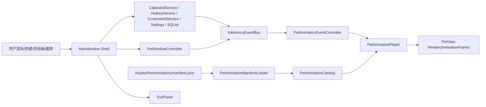

# GoBuddy Phase 3 桌宠核心体验层

## 1. 目标

Phase 3 的目标是把 Phase 2 的服务层接到更正式的桌宠体验层：桌宠不再只是静态窗口，而是由状态机、事件总线和动画层共同驱动的可交互 UI。

本阶段仍保持 AI/CLI 能力为前端预留：只探测 Codex CLI、Claude Code CLI 等本地 provider 是否存在，不执行真实命令。

## 2. 本阶段交付

- 基于 `PetWindowController` 保留窗口位置、可拖拽、透明命中与窗口状态管理。
- 新增动画资源模型：`AnimationFrame`、`AnimationClip`、`PetAnimationManifest`、`PetAnimationCatalog`。
- 新增动画 manifest 加载器：从本地 JSON 加载动作、帧时长、循环、优先级和 fallback。
- 新增 fallback 动画目录：即使资源文件缺失或损坏，所有 `PetAction` 仍有默认动画。
- 新增动画播放器：按帧推进，非循环动作完成后回落到 idle 或指定 fallback。
- 新增事件驱动动画层：监听宠物状态、剪贴板、截图、热键事件并切换动画。
- 拆分 WPF UI：`MainWindow` 作为 shell，`PetView` 渲染宠物，`ToolPanel` 承载工具入口、剪贴板列表和 AI/CLI 预留区。
- 增强交互：hover、click/poke、double click、drag、sleep/wake、截图成功/失败、剪贴板复制、AI provider 探测状态反馈。

## 3. 核心架构



## 4. 动画 Manifest 格式

文件位置：

`src/GoBuddy.App/Assets/PetAnimations/manifest.json`

构建输出会复制到：

`src/GoBuddy.App/bin/Debug/net8.0-windows/Assets/PetAnimations/manifest.json`

示例结构：

```json
{
  "version": 1,
  "clips": [
    {
      "action": "Poke",
      "loop": false,
      "priority": 3,
      "fallbackAction": "Idle",
      "frames": [
        {
          "id": "poke-1",
          "durationMs": 90,
          "badge": "!",
          "offsetY": -4,
          "scale": 1.08,
          "color": "#F97316"
        }
      ]
    }
  ]
}
```

字段规则：

| 字段 | 含义 |
| --- | --- |
| `action` | 绑定的 `PetAction`，如 `Idle`、`Hover`、`Poke`、`Sleep` |
| `loop` | 是否循环播放 |
| `priority` | 预留给后续打断策略，目前用于资源描述和测试覆盖 |
| `fallbackAction` | 非循环动作完成后的回落动作 |
| `frames[].durationMs` | 单帧停留时间 |
| `frames[].badge` | 当前 PoC 用文本徽标表达动作 |
| `frames[].offsetY` | 垂直位移动效 |
| `frames[].scale` | 缩放动效 |
| `frames[].color` | 动作主色 |

## 5. 状态与事件映射

| 事件来源 | 事件 | 动画动作 |
| --- | --- | --- |
| 鼠标进入宠物 | UI mouse enter | `Hover` |
| 单击宠物 | UI click | `Poke` |
| 双击宠物 | UI double click | `Thinking` |
| 拖拽宠物 | UI drag | `Drag` |
| 睡眠按钮 | ToolPanel sleep | `Sleep` |
| 唤醒热键 | `HotkeyTriggeredEvent("pet.wake")` | `Poke` |
| 截图热键 | `HotkeyTriggeredEvent("screenshot.region")` | `Thinking` |
| 截图成功 | `ScreenshotCompletedEvent(true)` | `ScreenshotCaptured` |
| 截图失败 | `ScreenshotCompletedEvent(false)` | `Error` |
| 剪贴板文本变化 | `ClipboardChangedEvent` | `ClipboardCopied` |
| AI/CLI 探测开始 | UI action | `Thinking` |
| AI/CLI 探测完成 | UI action | `Poke` |

## 6. UI 边界

- `MainWindow`：组合服务、窗口消息、状态渲染、事件桥接。
- `PetView`：只负责根据 `AnimationFrame` 渲染桌宠视觉，不直接访问服务。
- `ToolPanel`：只负责工具按钮、剪贴板列表、AI/CLI provider 状态展示，并通过事件把用户意图抛给 shell。
- `ScreenshotOverlayWindow`：继续作为截图选择覆盖层，不混入桌宠动画逻辑。

这个拆分使后续可以把 `PetView` 替换成 Sprite、Lottie、帧图、Live2D 或更复杂的渲染层，而不影响剪贴板、截图、热键等能力。

## 7. 验证记录

执行时间：2026-08-02

| 验证项 | 命令 | 结果 |
| --- | --- | --- |
| 构建 | `.tools\dotnet\dotnet.exe build GoBuddy.sln` | 通过，0 warning，0 error |
| 单元测试 | `.tools\dotnet\dotnet.exe test GoBuddy.sln` | 通过，30 tests |
| 透明命中 | `scripts\smoke-hit-test.ps1` | 通过 |
| 拖拽持久化 | `scripts\smoke-drag-placement.ps1` | 通过，位置写入 settings |
| 区域截图 | `scripts\smoke-screenshot-capture.ps1` | 通过，新增 PNG 且剪贴板含图片 |
| 剪贴板 SQLite | `scripts\smoke-clipboard-sqlite.ps1` | 通过，SQLite 命中 1 条，日志存在 |
| Phase 3 动画层 | `scripts\smoke-phase3-animation.ps1` | 通过，manifest 已复制，窗口截图生成 |

可视化证据：

- `docs/phase3-animation-smoke.png`
- `docs/phase3-hotkey-animation-smoke.png`

## 8. 已知限制

- 当前动画还是 PoC 级文本/形变表现，尚未接入真实 sprite sheet、Lottie、Live2D 或 3D 资产。
- `priority` 已进入模型，但复杂打断策略还未完全展开，例如高优先级动作保护、队列动作、冷却时间。
- AI/CLI provider 仅做路径探测和状态展示，不启动 Codex CLI、Claude Code CLI，也不读取用户项目上下文。
- `ToolPanel` 仍是调试型工具面板，正式 MVP 可继续压缩视觉密度并增加托盘菜单。

## 9. Phase 4 建议

- 引入正式动画资产管线：帧图目录、sprite sheet metadata、透明 PNG 校验、资源热更新。
- 完成动作优先级和打断策略：例如截图/错误动作优先于 hover，拖拽结束自动回 idle。
- 增加系统托盘、设置页、开机启动和权限解释。
- 设计 AI/CLI Adapter 契约：只暴露 provider 探测、会话启动、命令确认、输出流、安全审批。
- 增加 UI 自动化测试或截图像素差分，降低桌宠视觉回归风险。
