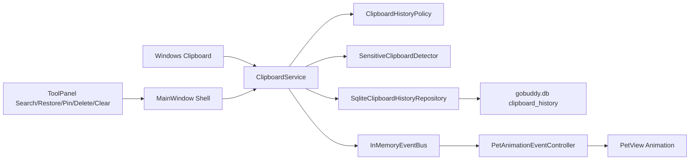

# GoBuddy Phase 4 剪贴板历史产品化

## 1. 目标

Phase 4 的目标是把剪贴板历史从 PoC 能力升级为可日常使用的效率工具，并让桌宠自然参与反馈：复制、恢复、搜索、删除、清空、收藏、敏感内容保护和异常失败都能驱动桌宠状态或动画。

本阶段仍保持本地优先：剪贴板文本写入本地 SQLite，AI/CLI provider 只探测，不执行真实命令。

## 2. 本阶段交付

- 扩展剪贴板历史数据模型：保留 `text`、`content_hash`、`created_at`、`source_application`、`is_favorite`，新增 `is_sensitive`、`content_type`。
- 扩展 SQLite 仓储：支持倒序读取、搜索、查找、删除、清空、收藏、去重写入和容量修剪。
- 新增轻量迁移：旧库启动时自动补齐 `is_sensitive` 与 `content_type` 列。
- 新增 `ClipboardHistoryPolicy`：集中配置容量、最大文本长度、重复抑制窗口、敏感内容是否隐藏。
- 新增敏感内容识别：识别 private key、password/token/api key 形态、长随机密钥片段。
- 扩展 `ClipboardService`：统一承载搜索、恢复、删除、清空、收藏、容量控制、敏感内容 redaction 和事件发布。
- 新增 `ClipboardProductActionEvent`：剪贴板产品动作通过事件总线驱动桌宠反馈。
- 升级 `ToolPanel`：新增搜索框、剪贴板预览、元信息、恢复、Pin、删除、清空操作。
- 保持 Phase 2/3 能力：热键、截图、SQLite、日志、设置、事件总线、动画层均可继续工作。

## 3. 产品架构

## 4. 数据模型

表：`clipboard_history`

| 字段 | 含义 |
| --- | --- |
| `id` | 历史条目 ID |
| `text` | 原始文本，本地保存 |
| `content_hash` | 文本 hash，用于去重 |
| `created_at` | 创建时间 |
| `source_application` | 来源应用，当前为 `unknown` 占位 |
| `is_favorite` | 是否 Pin/收藏 |
| `is_sensitive` | 是否命中敏感内容规则 |
| `content_type` | 内容类型，当前为 `text` |

读取顺序：`is_favorite DESC, created_at DESC`，即收藏优先，其余按时间倒序。

## 5. 交互规则

| 用户或系统动作 | 结果 | 桌宠反馈 |
| --- | --- | --- |
| 复制新文本 | 写入 SQLite，刷新列表 | `ClipboardCopied` |
| 复制敏感文本 | 写入 SQLite，UI 默认隐藏预览 | `Thinking`/敏感记录提示 |
| 短时间重复复制同一文本 | 抑制重复写入 | `ClipboardCopied`/重复抑制提示 |
| 搜索命中 | 列表显示匹配结果 | `Thinking` |
| 搜索无结果 | 显示空状态 | `Sleep` |
| 恢复历史 | 写回系统剪贴板，并抑制回环记录 | `ClipboardCopied` |
| Pin/取消 Pin | 更新 SQLite 与列表顺序 | `Poke` |
| 删除单条 | 删除 SQLite 条目并刷新列表 | `Poke` |
| 清空历史 | 二次确认后清空非收藏条目 | `Poke` |
| 读取或写入失败 | 记录日志并显示错误状态 | `Error` |

## 6. 敏感内容策略

当前策略是“保存但默认不明文展示”。原因是 MVP 需要用户能恢复自己复制过的重要文本，但 UI 不能把 token、密码、私钥直接暴露在桌面上。

默认命中规则：

- `-----BEGIN ... PRIVATE KEY-----`
- `password=...`、`api_key=...`、`access_token=...`、`secret=...`
- 32 位以上的长随机 token 片段

后续可以在设置页补充“忽略敏感内容，不入库”的模式。

## 7. 验证记录

执行时间：2026-08-02

| 验证项 | 命令 | 结果 |
| --- | --- | --- |
| 构建 | `.tools\dotnet\dotnet.exe build GoBuddy.sln` | 通过，0 warning，0 error |
| 单元测试 | `.tools\dotnet\dotnet.exe test GoBuddy.sln` | 通过，40 tests |
| 透明命中 | `scripts\smoke-hit-test.ps1` | 通过 |
| 拖拽持久化 | `scripts\smoke-drag-placement.ps1` | 通过 |
| 基础剪贴板 SQLite | `scripts\smoke-clipboard-sqlite.ps1` | 通过，SQLite 命中 1 条，日志存在 |
| 剪贴板产品化 | `scripts\smoke-phase4-clipboard-product.ps1` | 通过，搜索、收藏、删除、清空非收藏状态正确 |
| 区域截图回归 | `scripts\smoke-screenshot-capture.ps1` | 通过，新增 PNG 且剪贴板含图片 |
| 桌宠动画回归 | `scripts\smoke-phase3-animation.ps1` | 通过，Phase 4 窗口截图生成 |

可视化证据：

- `docs/phase3-animation-smoke.png`
- `docs/phase3-hotkey-animation-smoke.png`

## 8. 已知限制

- 来源应用仍是 `unknown` 占位，尚未接入前台进程识别。
- 清空操作当前保留 Pin 条目，尚未提供“包含收藏一起清空”的高级入口。
- 敏感内容策略当前为规则识别，可能存在误报或漏报。
- UI 仍是 MVP 面板形态，尚未做虚拟列表、分组、键盘导航和高级过滤。
- 图片、HTML、文件列表等非文本剪贴板类型暂未产品化。

## 9. Phase 5 建议

- 截图历史进入 SQLite，和剪贴板历史共享“最近活动”或“素材库”视图。
- 截图成功后把图片记录关联到剪贴板事件，让桌宠能区分“文本复制”和“图片复制”。
- 增加截图预览、打开目录、复制路径、取消/失败状态反馈。
- 为未来 AI/CLI 能力定义安全的素材引用协议，例如只传递用户明确选择的剪贴板条目或截图文件。
