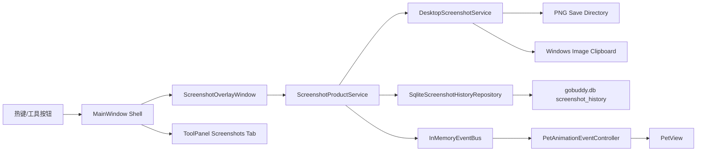

# GoBuddy Phase 5 截图产品化

## 1. 目标

Phase 5 的目标是把截图从 PoC 区域截屏升级为可日常使用的截图工具。截图流程需要具备稳定的区域选择、保存策略、剪贴板复制、历史记录、最近预览、路径操作、取消/失败反馈，并让桌宠参与每个关键状态。

本阶段继续保持本地优先：截图文件保存到本地目录，截图历史写入本地 SQLite，不执行 AI/CLI 命令。

## 2. 本阶段交付

- 新增截图历史数据模型：`ScreenshotHistoryItem`、`ScreenshotHistoryViewItem`。
- 新增截图历史仓储接口：`IScreenshotHistoryRepository`。
- 新增 SQLite 实现：`SqliteScreenshotHistoryRepository`，表名 `screenshot_history`。
- 新增截图产品服务：`ScreenshotProductService`，统一处理截图调用、历史保存、产品事件发布。
- 扩展截图结果：`ScreenshotCaptureResult` 现在包含宽、高、是否复制到剪贴板。
- 优化截图覆盖层：拖拽选择时显示尺寸标签，支持 Esc 取消，小区域失败有明确结果。
- 升级工具面板：新增 `Screenshots` tab，支持最近截图历史、预览、打开目录、复制路径、标注入口预留。
- 新增截图产品事件：`ScreenshotProductActionEvent`，驱动桌宠进入等待选择、选择中、成功、复制、取消、失败等反馈状态。
- 更新 smoke：区域截图 smoke 现在同时验证 PNG 文件、剪贴板图片和 `screenshot_history` 数据。

## 3. 架构

## 4. 数据模型

表：`screenshot_history`

| 字段 | 含义 |
| --- | --- |
| `id` | 截图历史 ID |
| `file_path` | PNG 文件路径 |
| `created_at` | 创建时间 |
| `width` | 截图宽度 |
| `height` | 截图高度 |
| `success` | 是否成功 |
| `message` | 成功或失败信息 |
| `copied_to_clipboard` | 是否已复制图片到系统剪贴板 |

读取顺序：`created_at DESC`。

## 5. 截图流程

1. 用户点击 `Shot` 或按 `Ctrl+Shift+S`。
2. 主窗口发布 `screenshot.overlay.opened`，桌宠进入 `Thinking`。
3. 覆盖层全屏显示暗色遮罩，鼠标拖拽产生白色边框与尺寸标签。
4. 拖拽过程中发布 `screenshot.selection.dragging`，桌宠持续显示选择中状态。
5. 鼠标释放后，如果区域小于 `8 x 8`，返回失败并提示区域过小。
6. 合法区域会调用 `ScreenshotProductService.Capture`。
7. 底层服务保存 PNG，并复制图片到系统剪贴板。
8. 产品服务写入 `screenshot_history`，发布保存和复制事件。
9. 工具面板刷新最近截图列表，并预览最新截图。

## 6. 交互规则

| 动作 | 系统结果 | 桌宠反馈 |
| --- | --- | --- |
| 启动截图 | 打开覆盖层 | `Thinking` |
| 拖拽选择 | 显示边框和尺寸标签 | `Thinking` |
| Esc 取消 | 关闭覆盖层，显示取消状态 | `Sleep` |
| 区域过小 | 返回失败结果 | `Error` |
| 保存成功 | PNG 写入配置目录 | `ScreenshotCaptured` |
| 复制成功 | 图片进入系统剪贴板 | `ClipboardCopied` |
| 打开目录 | 打开截图保存目录 | `Poke` |
| 复制路径 | 复制文件路径文本 | `ClipboardCopied` |
| 标注入口 | 显示 Phase 6 预留提示 | `Thinking` |

## 7. 保存策略

- 如果 `ScreenshotSettings.SaveDirectory` 为空，使用 `%LocalAppData%\GoBuddy\Screenshots`。
- 保存目录不存在时自动创建。
- 文件名由 `ScreenshotFileNameFactory` 生成，格式为 `screenshot-yyyyMMdd-HHmmss.png`。
- 当前历史保留读取数量由 `ScreenshotSettings.HistoryLimit` 控制，默认 30。

## 8. 验证记录

执行时间：2026-08-02

| 验证项 | 命令 | 结果 |
| --- | --- | --- |
| 构建 | `.tools\dotnet\dotnet.exe build GoBuddy.sln` | 通过，0 warning，0 error |
| 单元测试 | `.tools\dotnet\dotnet.exe test GoBuddy.sln` | 通过，46 tests |
| 透明命中 | `scripts\smoke-hit-test.ps1` | 通过 |
| 拖拽持久化 | `scripts\smoke-drag-placement.ps1` | 通过 |
| 剪贴板 SQLite 回归 | `scripts\smoke-clipboard-sqlite.ps1` | 通过 |
| 剪贴板产品化回归 | `scripts\smoke-phase4-clipboard-product.ps1` | 通过 |
| 截图产品化 | `scripts\smoke-screenshot-capture.ps1` | 通过，新增 PNG、剪贴板含图片、历史表记录宽高与成功状态 |
| 桌宠动画回归 | `scripts\smoke-phase3-animation.ps1` | 通过，Phase 5 窗口截图生成 |

可视化证据：

- `docs/phase3-animation-smoke.png`
- `docs/phase3-hotkey-animation-smoke.png`

## 9. 已知限制

- 标注能力只保留入口和状态提示，完整画笔、箭头、马赛克放到 Phase 6。
- 截图历史当前只记录截图，不支持删除、收藏或搜索。
- 覆盖层尚未支持多显示器 DPI 差异的高级校正，但已使用虚拟屏幕边界。
- 截图预览为最近截图缩略图，尚未实现独立大图查看器。
- 截图失败历史会记录到 SQLite，但 UI 当前主要展示最近历史列表。

## 10. Phase 6 建议

- 完成截图标注工具：画笔、箭头、矩形、文字、马赛克、撤销、保存副本。
- 增加截图历史管理：删除、收藏、搜索、打开文件、复制图片。
- 将截图和剪贴板合并为“素材库”视图，支持文本、图片、文件路径统一管理。
- 为 AI/CLI Adapter 设计素材引用权限：只有用户明确选择的截图或剪贴板条目才能传给本地 CLI。
