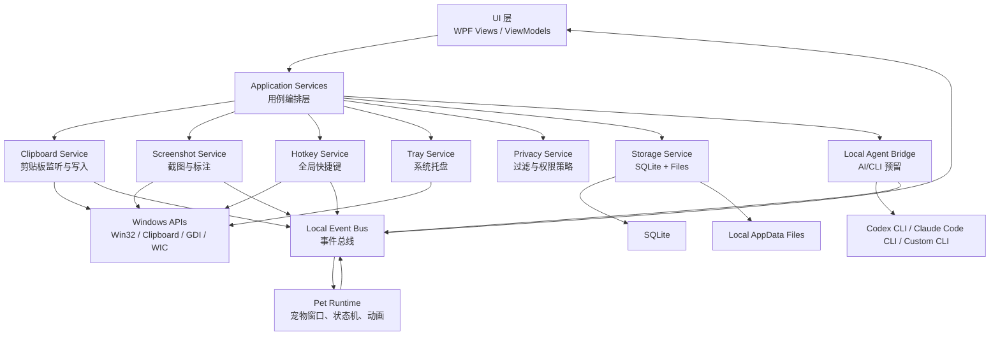
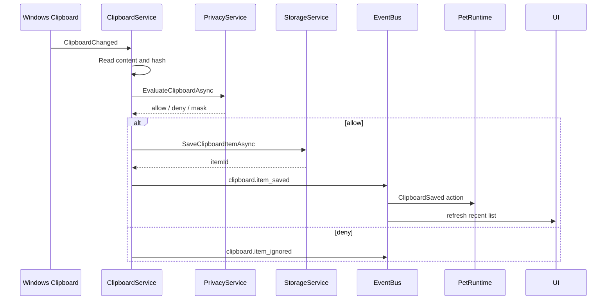
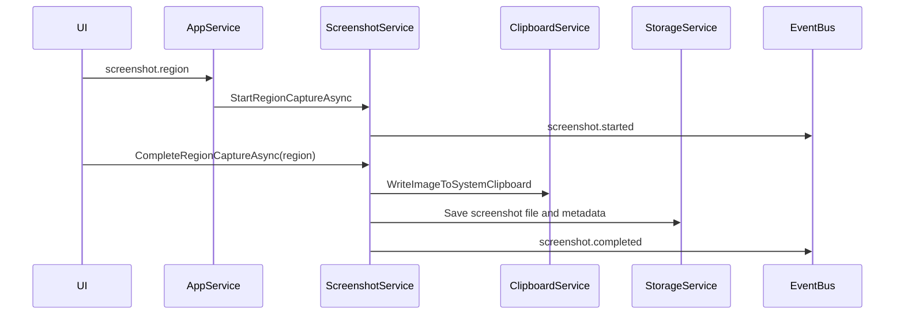
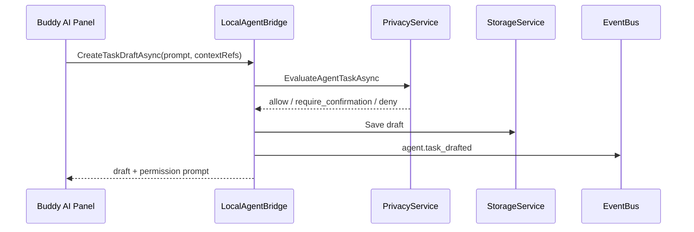
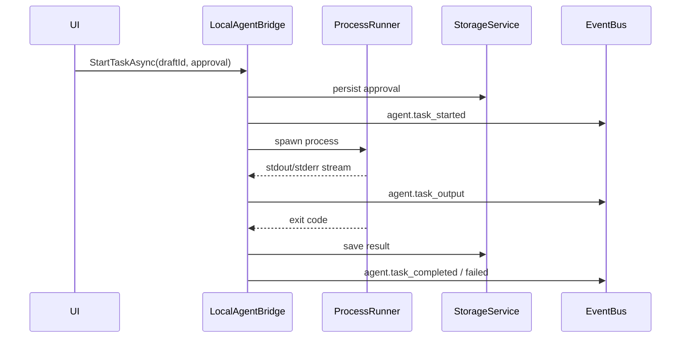

# GoBuddy 后端与接口层设计

## 1. 设计目标

本文档定义 GoBuddy Windows 客户端的本地后端、接口层、数据模型和未来 AI/本地 CLI 扩展边界，为正式客户端开发做准备。

GoBuddy 的“后端”在 MVP 阶段不是云服务，而是运行在用户本机的应用服务层。它负责封装 Windows 系统能力、数据持久化、隐私策略、任务调度和前端状态同步。

## 2. 设计原则

- 本地优先：剪贴板、截图、设置、宠物状态和 AI 预留数据默认都保存在本机。
- 权限前置：任何读取敏感数据、执行本地命令、访问工作区或修改文件的操作都必须经过用户确认。
- UI 与系统能力解耦：界面不直接调用 Win32、剪贴板、截图或 CLI，而是通过应用服务接口调用。
- 事件驱动：剪贴板变化、截图完成、宠物状态变化、CLI 任务状态都通过事件总线广播。
- 可替换：MVP 可以用 WPF 前端，后续也可以替换为 WinUI、WebView 或 Avalonia，只要接口契约稳定。
- 可审计：AI/CLI 任务必须保留请求、确认、执行、结果和失败原因。

## 3. 技术基线建议

| 层级 | 建议方案 | 说明 |
| --- | --- | --- |
| 桌面客户端 | .NET 8 + WPF | 与 PRD 保持一致，方便处理透明窗口、托盘、热键、Win32 互操作 |
| 本地服务层 | .NET Hosted Service / DI Services | 应用进程内服务，不单独起 HTTP 服务 |
| UI 通信 | ViewModel + 内部事件总线 | WPF 原生优先，避免过早引入 Web 后端 |
| 持久化 | SQLite + 本地文件目录 | SQLite 存元数据，图片/截图存文件 |
| 后台任务 | Channel / Task Queue | 用于截图保存、清理、AI 任务排队 |
| 系统事件 | Win32 message pump | 剪贴板、热键、托盘、窗口事件 |
| AI/CLI 预留 | Local Agent Bridge | 后续封装 Codex CLI、Claude Code CLI 等 |

参考方向：

- ShareX：可参考截图、托盘、热键、OCR、标注和任务工作流。
- CopyQ：可参考剪贴板历史、搜索、收藏、自定义分组和脚本扩展能力。
- NHotkey：可参考 WPF/WinForms 全局快捷键封装。

注意：参考成熟项目时优先参考产品能力和模块边界。若未来复用代码或库，需要单独检查开源协议、许可证兼容性和商业化限制。

## 4. 总体架构



## 5. 模块划分

### 5.1 Shell 模块

职责：

- 应用启动和退出。
- 单实例控制。
- DI 容器初始化。
- 配置加载。
- 数据库迁移。
- 后台服务启动和释放。

关键接口：

```csharp
public interface IAppShell
{
    Task StartAsync(CancellationToken cancellationToken);
    Task ShutdownAsync();
    AppRuntimeState GetRuntimeState();
}
```

### 5.2 Pet Runtime

职责：

- 维护宠物窗口位置、大小、置顶、透明区域命中。
- 维护宠物状态机。
- 接收系统事件后触发动画。
- 向 UI 层广播宠物状态变化。

核心状态：

```csharp
public enum PetMood
{
    Idle,
    Happy,
    Thinking,
    Working,
    Dragging,
    Sleeping,
    Alert
}

public enum PetAction
{
    Click,
    Hover,
    DragStart,
    DragMove,
    DragEnd,
    ClipboardSaved,
    ScreenshotStarted,
    ScreenshotDone,
    AiTaskStarted,
    AiTaskCompleted,
    Pause
}
```

关键接口：

```csharp
public interface IPetRuntime
{
    PetState GetState();
    Task DispatchActionAsync(PetAction action, object? payload = null);
    Task SetPositionAsync(double x, double y, string monitorId);
    Task SetVisibleAsync(bool visible);
}
```

### 5.3 Clipboard Service

职责：

- 监听剪贴板变化。
- 读取文本、图片、文件路径。
- 去重。
- 调用隐私过滤。
- 写入历史。
- 更新系统剪贴板。

关键接口：

```csharp
public interface IClipboardService
{
    Task StartAsync(CancellationToken cancellationToken);
    Task StopAsync();
    Task<IReadOnlyList<ClipboardItemDto>> QueryAsync(ClipboardQuery query);
    Task<ClipboardItemDto?> GetAsync(Guid id);
    Task RestoreToSystemClipboardAsync(Guid id, PasteMode mode);
    Task DeleteAsync(Guid id);
    Task ClearAsync(ClipboardClearScope scope);
    Task SetFavoriteAsync(Guid id, bool isFavorite);
}
```

查询对象：

```csharp
public sealed record ClipboardQuery(
    string? Keyword,
    ClipboardItemType? Type,
    bool? IsFavorite,
    int Limit,
    int Offset
);
```

### 5.4 Screenshot Service

职责：

- 进入截图模式。
- 管理遮罩窗口和选区。
- 捕获区域图片。
- 写入系统剪贴板。
- 保存到剪贴板历史。
- P1 阶段支持标注。

关键接口：

```csharp
public interface IScreenshotService
{
    Task<ScreenshotSessionDto> StartRegionCaptureAsync();
    Task<ScreenshotResultDto> CompleteRegionCaptureAsync(RectangleD region);
    Task CancelCaptureAsync(Guid sessionId);
    Task SaveToFileAsync(Guid screenshotId, string filePath);
}
```

### 5.5 Hotkey Service

职责：

- 注册全局快捷键。
- 检测快捷键冲突。
- 广播快捷键事件。
- 应用退出时释放注册。

关键接口：

```csharp
public interface IHotkeyService
{
    Task<IReadOnlyList<HotkeyBindingDto>> GetBindingsAsync();
    Task<RegisterHotkeyResult> RegisterAsync(HotkeyBindingDto binding);
    Task UnregisterAsync(string action);
    Task ResetDefaultsAsync();
}
```

默认动作：

| action | 默认快捷键 |
| --- | --- |
| clipboard.open | Alt + V |
| screenshot.region | Alt + Shift + S |
| pet.toggle | Alt + Shift + P |
| ai.open | Alt + Shift + A |

### 5.6 Settings Service

职责：

- 读写应用设置。
- 保存窗口位置、宠物大小、快捷键、历史保留策略。
- 提供设置变更事件。

关键接口：

```csharp
public interface ISettingsService
{
    Task<T> GetAsync<T>(string key, T defaultValue);
    Task SetAsync<T>(string key, T value);
    Task<AppSettingsDto> GetAllAsync();
    Task UpdateAsync(AppSettingsPatch patch);
}
```

### 5.7 Privacy Service

职责：

- 判断剪贴板内容是否允许保存。
- 判断截图是否允许进入历史。
- 管理排除应用列表。
- 管理敏感规则。
- 未来为 AI/CLI 任务做权限判定。

关键接口：

```csharp
public interface IPrivacyService
{
    Task<PrivacyDecision> EvaluateClipboardAsync(ClipboardCaptureContext context);
    Task<PrivacyDecision> EvaluateScreenshotAsync(ScreenshotCaptureContext context);
    Task<PrivacyDecision> EvaluateAgentTaskAsync(AgentTaskDraft task);
    Task<IReadOnlyList<PrivacyRuleDto>> GetRulesAsync();
    Task SaveRuleAsync(PrivacyRuleDto rule);
    Task DeleteRuleAsync(Guid id);
}
```

### 5.8 Storage Service

职责：

- SQLite 数据库访问。
- 图片文件保存。
- 定期清理。
- 数据导出和清空。

关键接口：

```csharp
public interface IStorageService
{
    Task InitializeAsync();
    Task SaveClipboardItemAsync(ClipboardItemEntity item);
    Task<IReadOnlyList<ClipboardItemEntity>> QueryClipboardItemsAsync(ClipboardQuery query);
    Task SaveEventAsync(AppEventEntity appEvent);
    Task CleanupAsync(CleanupPolicy policy);
}
```

### 5.9 Local Agent Bridge

MVP 只定义接口，不实现真实命令执行。

职责：

- 发现本地 CLI 是否安装。
- 管理 Provider 配置。
- 生成待确认任务。
- 后续执行 Codex CLI、Claude Code CLI 或自定义命令。
- 管理执行日志和权限确认。

关键接口：

```csharp
public interface ILocalAgentBridge
{
    Task<IReadOnlyList<AgentProviderDto>> ListProvidersAsync();
    Task<AgentProviderProbeResult> ProbeProviderAsync(string providerId);
    Task<AgentTaskDraft> CreateTaskDraftAsync(CreateAgentTaskRequest request);
    Task<AgentPermissionPrompt> PreparePermissionPromptAsync(Guid draftId);
    Task<AgentTaskDto> StartTaskAsync(Guid draftId, AgentUserApproval approval);
    Task<AgentTaskDto> GetTaskAsync(Guid taskId);
    IAsyncEnumerable<AgentTaskEventDto> WatchTaskAsync(Guid taskId, CancellationToken cancellationToken);
    Task CancelTaskAsync(Guid taskId);
}
```

Provider 初始设计：

```json
{
  "id": "codex",
  "displayName": "Codex CLI",
  "executable": "codex",
  "status": "not_installed | pending | connected | error",
  "capabilities": ["workspace_chat", "code_edit", "task_plan"],
  "requiresApproval": true
}
```

## 6. 应用内接口风格

MVP 推荐使用“进程内服务接口 + 事件总线”，不必先做 HTTP API。

如果后续使用 WebView 前端，可以在同一套服务上增加 Bridge 层：

- `window.gobuddy.clipboard.query`
- `window.gobuddy.screenshot.startRegionCapture`
- `window.gobuddy.pet.dispatchAction`
- `window.gobuddy.agent.createTaskDraft`
- `window.gobuddy.settings.update`

Bridge 返回统一响应：

```ts
type ApiResult<T> = {
  ok: boolean;
  data?: T;
  error?: {
    code: string;
    message: string;
    details?: unknown;
  };
};
```

错误码规范：

| code | 含义 |
| --- | --- |
| permission_denied | 用户拒绝或策略拒绝 |
| not_found | 资源不存在 |
| invalid_input | 参数不合法 |
| hotkey_conflict | 快捷键冲突 |
| provider_not_installed | 本地 CLI 未安装 |
| provider_not_configured | Provider 未配置 |
| task_cancelled | 任务被取消 |
| system_api_failed | Windows API 调用失败 |
| storage_failed | 本地存储失败 |

## 7. 事件总线设计

事件命名采用领域前缀。

| 事件 | 触发时机 | 主要消费者 |
| --- | --- | --- |
| app.started | 应用启动完成 | UI、Pet |
| app.paused | 用户暂停监听 | UI、Clipboard、Pet |
| clipboard.changed | 检测到系统剪贴板变化 | Clipboard |
| clipboard.item_saved | 历史保存成功 | UI、Pet |
| clipboard.item_restored | 用户恢复历史项 | UI、Pet |
| screenshot.started | 进入截图模式 | UI、Pet |
| screenshot.completed | 截图完成 | UI、Clipboard、Pet |
| hotkey.triggered | 全局快捷键触发 | AppSvc |
| pet.action | 宠物交互动作 | Pet、UI |
| agent.provider_changed | AI Provider 状态变化 | UI |
| agent.task_drafted | AI 任务草稿生成 | UI |
| agent.task_started | AI 任务开始 | UI、Pet |
| agent.task_completed | AI 任务完成 | UI、Pet |
| agent.task_failed | AI 任务失败 | UI、Pet |

事件载荷示例：

```json
{
  "id": "evt_01H...",
  "type": "clipboard.item_saved",
  "occurredAt": "2026-08-02T14:24:31+08:00",
  "payload": {
    "itemId": "clip_01H...",
    "itemType": "text",
    "preview": "const getData = async () => {"
  }
}
```

## 8. 数据库设计

### 8.1 clipboard_items

```sql
CREATE TABLE clipboard_items (
  id TEXT PRIMARY KEY,
  type TEXT NOT NULL,
  text_content TEXT NULL,
  file_path TEXT NULL,
  preview TEXT NOT NULL,
  content_hash TEXT NOT NULL,
  source_app TEXT NULL,
  source_window_title TEXT NULL,
  is_favorite INTEGER NOT NULL DEFAULT 0,
  is_sensitive INTEGER NOT NULL DEFAULT 0,
  created_at TEXT NOT NULL,
  last_used_at TEXT NULL
);

CREATE UNIQUE INDEX idx_clipboard_items_hash ON clipboard_items(content_hash);
CREATE INDEX idx_clipboard_items_created_at ON clipboard_items(created_at);
CREATE INDEX idx_clipboard_items_type ON clipboard_items(type);
CREATE INDEX idx_clipboard_items_favorite ON clipboard_items(is_favorite);
```

### 8.2 app_settings

```sql
CREATE TABLE app_settings (
  key TEXT PRIMARY KEY,
  value_json TEXT NOT NULL,
  updated_at TEXT NOT NULL
);
```

### 8.3 privacy_rules

```sql
CREATE TABLE privacy_rules (
  id TEXT PRIMARY KEY,
  rule_type TEXT NOT NULL,
  pattern TEXT NOT NULL,
  action TEXT NOT NULL,
  enabled INTEGER NOT NULL DEFAULT 1,
  created_at TEXT NOT NULL,
  updated_at TEXT NOT NULL
);
```

### 8.4 agent_providers

```sql
CREATE TABLE agent_providers (
  id TEXT PRIMARY KEY,
  display_name TEXT NOT NULL,
  executable TEXT NOT NULL,
  args_template TEXT NULL,
  working_directory TEXT NULL,
  enabled INTEGER NOT NULL DEFAULT 0,
  last_probe_status TEXT NULL,
  last_probe_at TEXT NULL,
  created_at TEXT NOT NULL,
  updated_at TEXT NOT NULL
);
```

### 8.5 agent_tasks

```sql
CREATE TABLE agent_tasks (
  id TEXT PRIMARY KEY,
  provider_id TEXT NOT NULL,
  status TEXT NOT NULL,
  user_prompt TEXT NOT NULL,
  context_summary TEXT NULL,
  proposed_command TEXT NULL,
  working_directory TEXT NULL,
  approval_status TEXT NOT NULL DEFAULT 'pending',
  started_at TEXT NULL,
  completed_at TEXT NULL,
  exit_code INTEGER NULL,
  result_summary TEXT NULL,
  error_message TEXT NULL,
  created_at TEXT NOT NULL
);

CREATE INDEX idx_agent_tasks_provider ON agent_tasks(provider_id);
CREATE INDEX idx_agent_tasks_status ON agent_tasks(status);
```

### 8.6 app_events

```sql
CREATE TABLE app_events (
  id TEXT PRIMARY KEY,
  type TEXT NOT NULL,
  payload_json TEXT NOT NULL,
  created_at TEXT NOT NULL
);

CREATE INDEX idx_app_events_type ON app_events(type);
CREATE INDEX idx_app_events_created_at ON app_events(created_at);
```

## 9. 本地文件目录

建议使用：

```text
%AppData%\GoBuddy\
  gobuddy.db
  assets\
    pets\
    themes\
  clipboard\
    images\
    files\
  screenshots\
  logs\
  exports\
```

规则：

- SQLite 只存元数据和小文本。
- 图片、截图等大对象存文件，并在数据库中保存路径和哈希。
- 清空历史时必须同时清理文件和数据库记录。
- 日志不得记录完整剪贴板内容、截图内容或完整命令输出。

## 10. 关键流程接口

### 10.1 剪贴板监听与保存



### 10.2 区域截图



### 10.3 AI 任务草稿生成

MVP 阶段只到任务草稿，不执行真实 CLI。



### 10.4 未来 CLI 执行



## 11. AI/CLI 安全设计

### 11.1 命令执行等级

| 等级 | 示例 | 策略 |
| --- | --- | --- |
| L0 只读 | 查询版本、读取帮助、检测安装 | 可自动执行，但需记录 |
| L1 读取上下文 | 读取当前工作区文件、总结剪贴板 | 首次确认，可记住授权 |
| L2 修改文件 | 代码修改、格式化、生成文件 | 每次执行前确认 |
| L3 网络/安装依赖 | 下载依赖、访问外网、调用远程模型 | 每次执行前强确认 |
| L4 高风险 | 删除目录、批量移动、系统设置修改 | 默认禁止，除非高级模式 |

### 11.2 权限确认对象

```json
{
  "draftId": "task_01H...",
  "providerId": "codex",
  "riskLevel": "L2",
  "workingDirectory": "D:\\GoBuddy",
  "proposedCommand": "codex exec \"解释当前剪贴板代码\"",
  "willRead": ["clipboard.current", "workspace:D:\\GoBuddy"],
  "willWrite": [],
  "networkAccess": false,
  "requiresUserConfirmation": true
}
```

### 11.3 禁止项

默认禁止：

- 静默执行会修改文件的命令。
- 静默读取用户主目录、桌面、下载、浏览器数据、密码管理器数据。
- 将完整剪贴板历史发送到远程模型。
- 自动带入 Token、Cookie、SSH Key、API Key。
- 在未展示命令和工作目录的情况下启动 CLI。

## 12. DTO 草案

### ClipboardItemDto

```json
{
  "id": "clip_01H...",
  "type": "text",
  "preview": "const getData = async () => {",
  "textContent": "const getData = async () => {...}",
  "filePath": null,
  "sourceApp": "Code.exe",
  "isFavorite": true,
  "isSensitive": false,
  "createdAt": "2026-08-02T14:24:31+08:00",
  "lastUsedAt": null
}
```

### ScreenshotResultDto

```json
{
  "id": "shot_01H...",
  "width": 512,
  "height": 338,
  "filePath": "%AppData%\\GoBuddy\\screenshots\\shot_01H.png",
  "copiedToClipboard": true,
  "savedAsClipboardItemId": "clip_01H..."
}
```

### PetState

```json
{
  "mood": "thinking",
  "visible": true,
  "position": {
    "x": 1120,
    "y": 690,
    "monitorId": "DISPLAY1"
  },
  "size": 1.0,
  "isTopMost": true,
  "bubbleText": "我可以帮你整理这段内容"
}
```

### AgentTaskDraft

```json
{
  "id": "draft_01H...",
  "providerId": "codex",
  "userPrompt": "解释当前剪贴板里的代码",
  "contextRefs": [
    {
      "type": "clipboard_item",
      "id": "clip_01H..."
    }
  ],
  "proposedCommand": "codex exec \"解释当前剪贴板里的代码\"",
  "riskLevel": "L1",
  "status": "waiting_for_confirmation"
}
```

## 13. 配置项设计

```json
{
  "app.startOnBoot": true,
  "pet.visible": true,
  "pet.topMost": true,
  "pet.size": 1.0,
  "pet.snapToEdge": true,
  "clipboard.enabled": true,
  "clipboard.maxItems": 1000,
  "clipboard.retentionDays": 30,
  "clipboard.saveImages": true,
  "screenshot.copyToClipboard": true,
  "screenshot.saveToHistory": true,
  "hotkeys.clipboard.open": "Alt+V",
  "hotkeys.screenshot.region": "Alt+Shift+S",
  "hotkeys.pet.toggle": "Alt+Shift+P",
  "hotkeys.ai.open": "Alt+Shift+A",
  "agent.enabled": false,
  "agent.defaultProvider": "codex",
  "agent.requireApprovalAlways": true
}
```

## 14. 后续代码结构建议

```text
src/
  GoBuddy.App/
    App.xaml
    Views/
    ViewModels/
    Resources/
  GoBuddy.Core/
    Models/
    Events/
    UseCases/
    Interfaces/
  GoBuddy.Infrastructure/
    Clipboard/
    Screenshot/
    Hotkeys/
    Tray/
    Storage/
    Privacy/
    AgentBridge/
    Windows/
  GoBuddy.Tests/
    Unit/
    Integration/
```

依赖方向：

```text
App -> Core
App -> Infrastructure
Infrastructure -> Core
Core -> no dependency on App or Infrastructure
```

## 15. 开发阶段建议

### 阶段 A：本地服务骨架

- 创建 .NET 解决方案。
- 建立 Core / Infrastructure / App 分层。
- 建立事件总线。
- 建立 SQLite 初始化和设置服务。

### 阶段 B：系统能力接入

- 剪贴板监听。
- 快捷键注册。
- 托盘菜单。
- 宠物窗口。
- 截图原型。

### 阶段 C：产品闭环

- 剪贴板历史列表。
- 搜索、收藏、删除。
- 截图保存到历史。
- 宠物状态联动。
- 设置页。

### 阶段 D：AI/CLI 预留

- Agent Provider 配置表。
- Provider 探测。
- 任务草稿。
- 权限确认面板。
- 不执行真实命令，只模拟状态。

### 阶段 E：真实 CLI 桥接

- ProcessRunner。
- stdout/stderr 流式读取。
- 任务取消。
- 风险分级。
- 命令审计。

## 16. MVP 验收标准

- UI 层不直接调用 Win32 系统 API。
- 剪贴板、截图、热键、托盘都有独立服务接口。
- SQLite 数据表可以自动初始化。
- 宠物状态由事件驱动，而不是散落在 UI 点击事件中。
- AI 面板可以展示 Provider 和任务草稿，但不会执行真实命令。
- 所有可执行命令路径都经过权限模型预留。
- 应用退出能释放剪贴板监听、热键、托盘和后台任务。

## 17. 参考项目

- ShareX GitHub: https://github.com/ShareX/ShareX
- ShareX 官网: https://getsharex.com/
- CopyQ GitHub: https://github.com/hluk/CopyQ
- CopyQ 官网: https://hluk.github.io/CopyQ/
- NHotkey GitHub: https://github.com/thomaslevesque/NHotkey
- NHotkey.Wpf NuGet: https://www.nuget.org/packages/NHotkey.Wpf/
