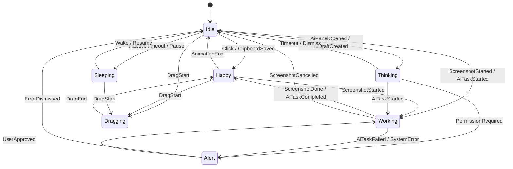
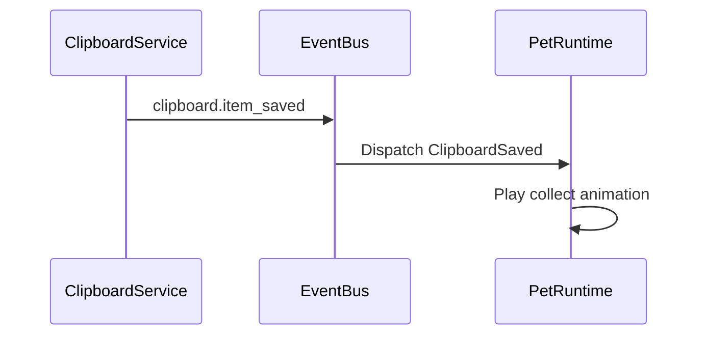

# GoBuddy 宠物动画与状态机设计

## 1. 设计目标

本文档定义 GoBuddy 桌宠的动画资源规范、状态机、事件触发、交互动作和工程实现边界。

目标是让桌宠既具备陪伴感，又能准确反馈系统工具状态，例如剪贴板保存、截图、暂停监听、AI 任务草稿等。

## 2. 设计原则

- 桌宠是产品主入口，不是纯装饰。
- 所有动画由状态机驱动，不散落在 UI 点击事件中。
- 工具状态优先于情绪状态，例如截图中、拖拽中、权限确认中。
- 动画资源可替换，状态协议保持稳定。
- MVP 优先 2D 序列帧，避免 Live2D/Spine 过早增加管线复杂度。
- 空闲时低频播放，避免常驻 CPU 占用过高。

## 3. MVP 动画资源方案

### 3.1 推荐格式

MVP 推荐使用 PNG 序列帧：

```text
assets/pets/default/
  manifest.json
  idle/
    000.png
    001.png
  happy/
  thinking/
  working/
  dragging/
  sleeping/
  alert/
```

理由：

- 资源可控，易替换。
- WPF 渲染简单。
- 便于精确控制帧率、循环、过渡。
- 后续可平滑迁移到 Lottie、Spine、Live2D。

### 3.2 资源规格

| 项 | MVP 建议 |
| --- | --- |
| 原始尺寸 | 512 x 512 或 768 x 768 |
| 背景 | 透明 PNG |
| 帧率 | Idle 8-12fps，动作 12-18fps |
| 色彩 | sRGB |
| 命名 | 3 位数字递增 |
| 每状态帧数 | MVP 6-24 帧 |
| 文件大小 | 单帧建议小于 300KB |

### 3.3 manifest.json

```json
{
  "id": "default-sprout",
  "displayName": "GoBuddy Sprout",
  "version": "0.1.0",
  "canvas": {
    "width": 512,
    "height": 512,
    "anchor": {
      "x": 256,
      "y": 480
    }
  },
  "hitTest": {
    "type": "alpha",
    "threshold": 32
  },
  "states": {
    "idle": {
      "path": "idle",
      "fps": 10,
      "loop": true
    },
    "happy": {
      "path": "happy",
      "fps": 16,
      "loop": false,
      "next": "idle"
    }
  }
}
```

## 4. 状态模型

### 4.1 PetMood

```csharp
public enum PetMood
{
    Idle,
    Happy,
    Thinking,
    Working,
    Dragging,
    Sleeping,
    Alert
}
```

### 4.2 PetAction

```csharp
public enum PetAction
{
    Click,
    Hover,
    Pet,
    DragStart,
    DragMove,
    DragEnd,
    ClipboardSaved,
    ClipboardRestored,
    ScreenshotStarted,
    ScreenshotDone,
    ScreenshotCancelled,
    AiPanelOpened,
    AiDraftCreated,
    AiTaskStarted,
    AiTaskCompleted,
    AiTaskFailed,
    Pause,
    Resume,
    InactiveTimeout,
    Wake,
    ErrorDismissed
}
```

### 4.3 状态优先级

| 优先级 | 状态 | 场景 |
| --- | --- | --- |
| 1 | Dragging | 用户正在拖拽宠物 |
| 2 | Working | 截图中、保存中、AI 任务执行中 |
| 3 | Alert | 错误、权限确认、风险提醒 |
| 4 | Thinking | AI 草稿、等待确认、分析中 |
| 5 | Happy | 点击、保存成功、任务完成 |
| 6 | Sleeping | 暂停监听、长时间空闲 |
| 7 | Idle | 默认 |

高优先级状态可以打断低优先级状态。低优先级状态不能打断高优先级状态，除非高优先级状态结束或超时。

## 5. 状态机



## 6. 动作到状态映射

| 动作 | 目标状态 | 动画 | 气泡文案示例 |
| --- | --- | --- | --- |
| Click | Happy | happy | 我在，想找刚复制的内容吗？ |
| Hover | Idle | idle-look | 鼠标靠近，眼神跟随 |
| Pet | Happy | happy | 这一下我收到了 |
| DragStart | Dragging | dragging | 被拎起来啦 |
| DragEnd | Happy | drop | 我站稳了 |
| ClipboardSaved | Happy | collect | 新内容已收进剪贴板 |
| ClipboardRestored | Happy | handoff | 已帮你放回剪贴板 |
| ScreenshotStarted | Working | working | 框选区域，我来收好 |
| ScreenshotDone | Happy | success | 截图已保存 |
| ScreenshotCancelled | Idle | idle | 已取消截图 |
| AiPanelOpened | Thinking | thinking | 我可以把内容交给本地 CLI |
| AiDraftCreated | Thinking | thinking | 已生成任务草稿，等你确认 |
| AiTaskStarted | Working | working | 本地任务执行中 |
| AiTaskCompleted | Happy | success | 任务完成 |
| AiTaskFailed | Alert | alert | 任务失败，看看原因 |
| Pause | Sleeping | sleeping | 我先不记录剪贴板啦 |
| Resume | Happy | wake | 我继续帮你看剪贴板 |

## 7. 动画播放规则

### 7.1 循环规则

| 动画 | 是否循环 | 结束后 |
| --- | --- | --- |
| idle | 是 | 保持 |
| sleeping | 是 | 保持 |
| dragging | 是 | 等待 DragEnd |
| working | 是 | 等待完成/失败 |
| happy | 否 | 回到 Idle |
| collect | 否 | 回到 Idle |
| success | 否 | 回到 Idle |
| alert | 是 | 等待用户处理 |

### 7.2 打断规则

- DragStart 可以打断任何状态。
- Alert 可以打断 Idle、Happy、Thinking、Working。
- Working 可以打断 Idle、Happy、Thinking。
- Sleeping 不能打断 Working、Dragging、Alert。
- Happy 不能打断 Working、Dragging、Alert。

### 7.3 超时规则

| 状态 | 默认超时 |
| --- | --- |
| Happy | 2.5s |
| Thinking | 8s |
| Alert | 不自动关闭 |
| Working | 不自动关闭 |
| Sleeping | 不自动关闭 |

## 8. 鼠标交互设计

### 8.1 命中区域

MVP 命中策略：

- 先使用资源整体矩形命中，保证实现简单。
- 尽快加入 alpha hit-test，透明像素不拦截鼠标。
- 宠物菜单、工具环和气泡有独立命中区域。

### 8.2 鼠标事件

| 事件 | 行为 |
| --- | --- |
| MouseEnter | 宠物看向鼠标，轻微反馈 |
| MouseMoveNear | 根据鼠标相对位置调整眼神方向 |
| LeftClick | 触发 Happy |
| DoubleClick | 打开剪贴板面板 |
| RightClick | 打开快捷菜单 |
| DragStart | 进入 Dragging |
| DragMove | 更新窗口位置 |
| DragEnd | 保存位置并播放落地动作 |

### 8.3 拖拽边界

- 拖拽时宠物不应离开所有显示器可见区域。
- 释放时若靠近屏幕边缘，可吸附。
- 多显示器下记录 `monitorId + x + y`。
- DPI 变化时根据显示器 scale 重新计算位置。

## 9. 工具联动

### 9.1 剪贴板联动



### 9.2 截图联动

- 进入截图：Working。
- 截图成功：Happy。
- 截图取消：Idle。
- 截图失败：Alert。

### 9.3 AI/CLI 联动

- 打开 AI 面板：Thinking。
- 生成任务草稿：Thinking。
- 等待权限确认：Alert 或 Thinking，取决于风险等级。
- 任务执行：Working。
- 任务完成：Happy。
- 任务失败：Alert。

## 10. ViewModel 状态

```csharp
public sealed partial class PetViewModel : ObservableObject
{
    [ObservableProperty]
    private PetMood mood;

    [ObservableProperty]
    private string? bubbleText;

    [ObservableProperty]
    private bool isToolDockOpen;

    [ObservableProperty]
    private bool isDragging;

    [ObservableProperty]
    private double scale;
}
```

## 11. 性能策略

- Idle/Sleeping 降帧播放。
- 窗口不可见时停止动画计时器。
- 使用单一 Composition/DispatcherTimer 驱动，不为每个状态创建独立 timer。
- 大图预加载，状态切换只换帧索引。
- 动画资源加载失败时回退到静态图。

## 12. 资源失败回退

| 失败 | 回退 |
| --- | --- |
| manifest 缺失 | 加载默认静态宠物 |
| 某状态帧缺失 | 回退 idle |
| PNG 损坏 | 跳过该帧并记录日志 |
| 全部资源失败 | 显示内置简化图 |

## 13. MVP 验收标准

- 至少支持 Idle、Happy、Thinking、Working、Dragging、Sleeping、Alert 七种状态。
- 点击、拖拽、剪贴板保存、截图开始/完成、暂停监听可触发对应状态。
- 状态优先级生效，Dragging 不被 Happy 打断。
- Happy 动画结束后自动回到 Idle。
- Working 状态不会自动结束，只由业务事件结束。
- 透明区域不应长期阻挡用户操作，alpha hit-test 作为阶段 0 或阶段 1 验证项。
- 空闲动画 CPU 占用目标低于 3%。

## 14. 后续扩展

- 支持多套宠物皮肤。
- 支持情绪强度，例如 HappyLow、HappyHigh。
- 支持动作组合，例如截图完成后先 Success 再 Idle。
- 支持语音或音效，但默认关闭。
- 支持 Live2D/Spine 作为高级动画资源。
