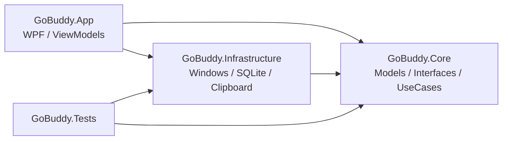
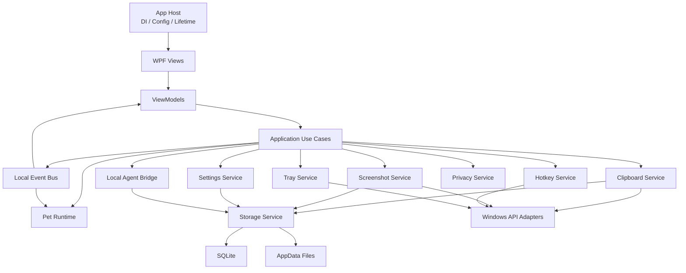
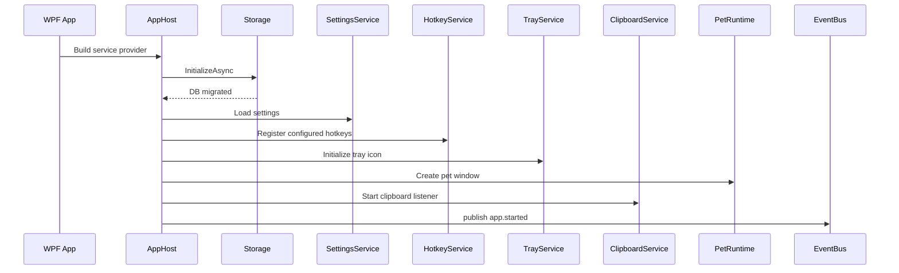
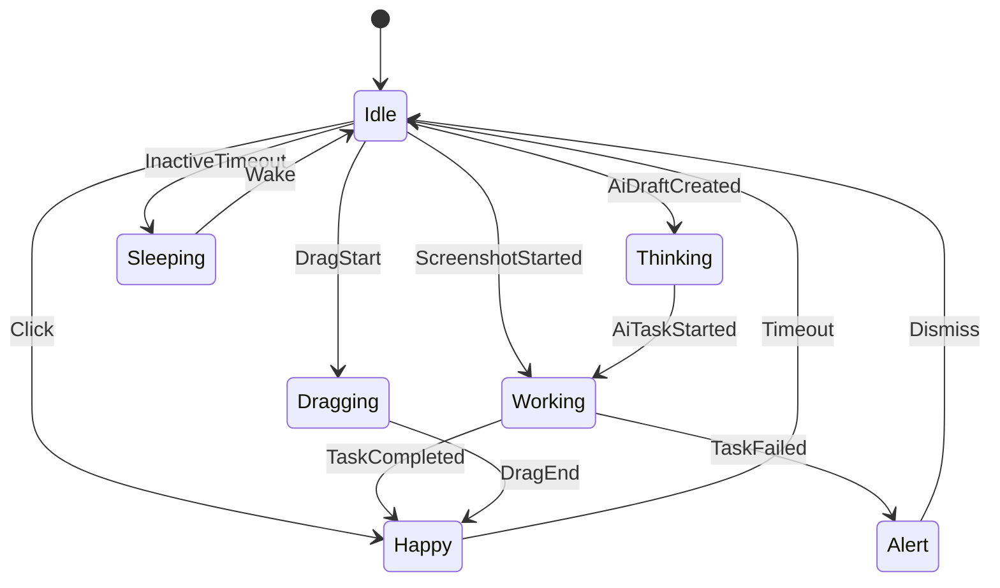

# GoBuddy 技术架构设计 TDD

## 1. 文档信息

| 项目 | 内容 |
| --- | --- |
| 产品 | GoBuddy Windows 桌面宠物效率助手 |
| 文档类型 | Technical Design Document |
| 版本 | v0.1 |
| 目标 | 指导正式客户端工程搭建与 MVP 技术实现 |
| 依赖文档 | `PRD-Windows桌面宠物效率助手.md`、`后端与接口层设计.md`、`客户端接口契约草案.md` |

## 2. 背景

GoBuddy 当前已完成产品 PRD、交互原型、后端与接口层设计。下一阶段要进入 Windows 客户端开发，需要先明确工程架构、模块边界、核心技术选型、启动流程、系统能力封装方式和未来 AI/CLI 扩展点。

本 TDD 的目标不是重新定义产品功能，而是把产品需求落到可执行的工程设计上。

## 3. 技术目标

### 3.1 MVP 技术目标

- 建立可维护的 .NET/WPF 工程结构。
- 跑通透明置顶桌宠窗口。
- 跑通宠物状态机和事件驱动机制。
- 跑通剪贴板监听、历史保存、搜索、恢复。
- 跑通区域截图、复制到剪贴板、保存到历史。
- 跑通托盘、全局快捷键、设置存储。
- 为 AI/本地 CLI 能力保留接口和数据模型，但不执行真实命令。

### 3.2 非目标

MVP 不做：

- 云服务后端。
- 登录账号。
- 多设备同步。
- 真实 AI 模型调用。
- 真实 Codex CLI / Claude Code CLI 执行。
- 完整截图标注编辑器。
- 插件市场。

## 4. 核心技术决策

| 决策 | 选择 | 理由 |
| --- | --- | --- |
| 桌面技术 | .NET 8 + WPF | Windows 透明窗口、托盘、热键、Win32 互操作成熟 |
| 架构风格 | 分层架构 + 事件驱动 | 降低 UI 与系统能力耦合 |
| UI 模式 | MVVM | WPF 生态成熟，便于测试和状态绑定 |
| 存储 | SQLite + 本地文件目录 | 本地优先、轻量、适合剪贴板元数据 |
| 系统能力封装 | Infrastructure 层封装 Win32 | Core 不依赖平台细节 |
| 后台任务 | Channel + BackgroundService 风格 | 适合剪贴板、清理、未来 Agent 任务队列 |
| AI/CLI | LocalAgentBridge 接口预留 | 未来可接 Codex CLI、Claude Code CLI、自定义命令 |
| 日志 | Microsoft.Extensions.Logging | 与 .NET DI/Host 体系兼容 |

## 5. 解决方案结构

建议正式代码结构：

```text
GoBuddy/
  src/
    GoBuddy.App/
      App.xaml
      App.xaml.cs
      MainWindow.xaml
      Views/
      ViewModels/
      Resources/
      Assets/
    GoBuddy.Core/
      Models/
      Events/
      Interfaces/
      UseCases/
      StateMachines/
      ValueObjects/
    GoBuddy.Infrastructure/
      AgentBridge/
      Clipboard/
      Hotkeys/
      Privacy/
      Screenshot/
      Storage/
      Tray/
      Windows/
    GoBuddy.Tests/
      Core.UnitTests/
      Infrastructure.Tests/
  docs/
  prototype/
```

### 5.1 项目职责

| 项目 | 职责 | 不应包含 |
| --- | --- | --- |
| GoBuddy.App | WPF Views、ViewModels、窗口生命周期、资源加载 | 直接操作 SQLite、Win32 细节、CLI 进程 |
| GoBuddy.Core | 领域模型、接口、事件、状态机、用例契约 | WPF、Win32、SQLite、文件系统实现 |
| GoBuddy.Infrastructure | 系统 API、存储、截图、热键、托盘、Agent Bridge 实现 | UI 控件和页面逻辑 |
| GoBuddy.Tests | 单元测试、集成测试、系统能力 smoke test | 产品代码 |

### 5.2 依赖方向



Core 必须保持纯净，不引用 WPF、Win32、SQLite 具体实现。

## 6. 运行时架构



## 7. 启动与退出流程

### 7.1 启动流程



### 7.2 退出流程

退出时必须按顺序释放资源：

1. 停止剪贴板监听。
2. 注销全局快捷键。
3. 取消截图会话。
4. 取消后台任务。
5. 保存宠物位置、窗口状态、设置。
6. 释放托盘图标。
7. Flush 日志。

## 8. 分层设计

### 8.1 App 层

主要对象：

- `App.xaml.cs`
- `MainWindow`
- `PetWindow`
- `ClipboardPanel`
- `ScreenshotOverlayWindow`
- `SettingsWindow`
- `AgentPanel`
- `ShellViewModel`
- `PetViewModel`
- `ClipboardViewModel`
- `ScreenshotViewModel`
- `SettingsViewModel`
- `AgentViewModel`

App 层允许依赖：

- Core 接口和 DTO。
- Infrastructure 注册后的服务实现。
- WPF 框架。

App 层禁止：

- 直接 P/Invoke。
- 直接读写 SQLite。
- 直接启动本地 CLI。
- 直接访问剪贴板底层 API。

### 8.2 Core 层

主要内容：

- DTO 和 Entity。
- 事件定义。
- 服务接口。
- 用例接口。
- 宠物状态机。
- 权限和风险等级模型。
- 错误码。

Core 示例：

```csharp
public interface IEventBus
{
    ValueTask PublishAsync<TEvent>(TEvent appEvent, CancellationToken cancellationToken = default)
        where TEvent : IAppEvent;

    IDisposable Subscribe<TEvent>(Func<TEvent, CancellationToken, ValueTask> handler)
        where TEvent : IAppEvent;
}
```

### 8.3 Infrastructure 层

主要适配器：

- `WindowsClipboardAdapter`
- `Win32HotkeyAdapter`
- `ScreenshotCaptureAdapter`
- `NotifyIconTrayAdapter`
- `SQLiteStorageService`
- `FileBlobStore`
- `PrivacyRuleEngine`
- `LocalAgentBridge`
- `ProcessRunner`

Infrastructure 可以依赖：

- `Microsoft.Data.Sqlite`
- `Microsoft.Extensions.*`
- WPF/WinForms 托盘相关包。
- Win32 P/Invoke。

## 9. 核心模块设计

### 9.1 EventBus

MVP 可先实现进程内同步/异步事件总线。

要求：

- 支持多订阅者。
- 单个订阅者异常不应阻断其他订阅者。
- 所有异常进入日志。
- UI 更新必须 marshal 到 WPF Dispatcher。
- 后续可替换为 Channel 事件流。

建议接口：

```csharp
public interface IAppEvent
{
    string Type { get; }
    DateTimeOffset OccurredAt { get; }
}
```

### 9.2 Pet Runtime

宠物状态机不应该写在 UI 点击事件里，应集中在 Core。

状态优先级：

| 优先级 | 状态 | 说明 |
| --- | --- | --- |
| 1 | Dragging | 用户正在拖拽，最高优先级 |
| 2 | Working | 截图、保存、AI 任务执行中 |
| 3 | Alert | 失败、风险确认、错误提示 |
| 4 | Happy | 点击、保存成功、任务完成 |
| 5 | Thinking | AI 草稿、等待确认、分析状态 |
| 6 | Sleeping | 暂停监听或长时间空闲 |
| 7 | Idle | 默认状态 |

状态切换示例：



### 9.3 Clipboard Service

实现要点：

- 使用隐藏消息窗口接收剪贴板更新消息。
- 读取剪贴板时做类型判断。
- 对文本内容计算 hash。
- 对图片内容保存文件后计算 hash。
- 过滤规则先于入库。
- 恢复历史项时需要避免触发自保存循环。

自保存循环处理：

```text
RestoreToSystemClipboardAsync
  -> set internal suppression token
  -> write system clipboard
  -> ignore next clipboard changed event with same hash
  -> clear token after timeout
```

### 9.4 Screenshot Service

MVP 实现：

- 创建全屏透明 overlay window。
- 多显示器下为每个 monitor 建立坐标映射。
- 使用物理像素捕获，保存时记录 DPI scale。
- 完成后写入系统剪贴板和本地文件。

风险点：

- 多屏负坐标。
- 高 DPI 缩放。
- HDR/色彩空间差异。
- 截图 overlay 抢焦点。

### 9.5 Hotkey Service

实现建议：

- MVP 可直接 Win32 `RegisterHotKey`。
- 后续可评估 NHotkey.Wpf。
- 每个快捷键绑定一个 action 字符串。
- 注册失败不影响应用启动，但 UI 必须显示冲突。

### 9.6 Tray Service

职责：

- 显示/隐藏宠物。
- 打开剪贴板面板。
- 开始截图。
- 暂停监听。
- 打开设置。
- 退出。

WPF 中可用 WinForms `NotifyIcon`，但要封装在 Infrastructure 中，不暴露给 App ViewModel。

### 9.7 Storage Service

实现策略：

- 使用 SQLite 保存元数据。
- 图片和截图保存到 `%AppData%\GoBuddy\`。
- 使用 migration 机制管理表结构变化。
- 文件写入使用临时文件 + rename，避免中途崩溃留下坏文件。
- 清理任务定期删除过期历史和孤儿文件。

### 9.8 Privacy Service

MVP 规则：

- 暂停监听时不保存任何新剪贴板。
- 命中密码管理器进程不保存。
- 命中常见 token/API key/private key 规则不保存。
- 用户排除应用不保存。

后续扩展：

- 敏感内容只保存 hash 和类型，不保存原文。
- 对 AI/CLI 上下文做二次权限判定。

### 9.9 Local Agent Bridge

MVP 只做：

- Provider 列表。
- Provider 探测接口。
- 任务草稿。
- 权限确认对象。
- 模拟任务状态。

不做：

- `Process.Start` 真实执行。
- 读取工作区文件。
- 网络调用。
- 写文件。

未来真实执行时必须新增：

- `IProcessRunner`
- stdout/stderr 流式事件。
- 取消 token。
- 风险等级。
- 审计日志。

## 10. 数据与文件设计

数据库表以 `后端与接口层设计.md` 为准，TDD 只补充实现策略。

### 10.1 数据库初始化

启动时：

1. 确认 `%AppData%\GoBuddy\` 存在。
2. 确认 `gobuddy.db` 存在。
3. 创建 `schema_migrations` 表。
4. 按版本执行迁移。
5. 写入默认设置和默认 Agent Provider。

### 10.2 迁移表

```sql
CREATE TABLE schema_migrations (
  version INTEGER PRIMARY KEY,
  name TEXT NOT NULL,
  applied_at TEXT NOT NULL
);
```

### 10.3 Blob 文件命名

```text
clipboard/images/{yyyy}/{MM}/{hash}.png
screenshots/{yyyy}/{MM}/{yyyyMMdd_HHmmss}_{shortId}.png
```

## 11. 配置设计

配置读取优先级：

1. 内置默认值。
2. SQLite `app_settings`。
3. 运行时用户修改。

不建议 MVP 引入复杂 JSON 配置文件。用户可见设置统一进 SQLite，便于设置页编辑和迁移。

## 12. 错误处理

统一错误模型：

```csharp
public sealed record AppError(
    string Code,
    string Message,
    string? TechnicalDetail = null,
    ErrorSeverity Severity = ErrorSeverity.Warning
);
```

错误分级：

| 级别 | 处理 |
| --- | --- |
| Info | 记录日志，不打扰用户 |
| Warning | UI 可展示轻提示 |
| Recoverable | 提供重试或设置入口 |
| Fatal | 显示错误页并建议重启 |

## 13. 日志设计

要求：

- 不记录完整剪贴板正文。
- 不记录截图文件内容。
- 不记录完整 CLI 输出。
- 可以记录 hash、长度、类型、来源应用、错误码。
- CLI 任务只记录命令摘要和风险等级。

日志位置：

```text
%AppData%\GoBuddy\logs\gobuddy-{date}.log
```

## 14. 安全设计

### 14.1 剪贴板安全

- 默认本地保存。
- 支持暂停监听。
- 支持排除应用。
- 敏感规则优先于入库。
- 恢复历史项时只写系统剪贴板，不自动粘贴，除非用户开启。

### 14.2 截图安全

- Esc 取消不入库。
- 截图完成后默认保存到历史，但可关闭。
- 未来如接 OCR/AI，必须二次确认。

### 14.3 AI/CLI 安全

- MVP 禁止真实命令执行。
- 未来执行命令前必须展示 Provider、命令、工作目录、风险等级、读写范围。
- 高风险命令默认禁止。
- 工作区授权按目录粒度保存。

## 15. 性能设计

目标：

| 指标 | MVP 目标 |
| --- | --- |
| 冷启动到宠物可见 | 3 秒内 |
| 剪贴板面板打开 | 300ms 内 |
| 1000 条历史搜索 | 500ms 内 |
| 截图 overlay 显示 | 500ms 内 |
| 空闲 CPU | 低于 3% |
| 常驻内存 | 尽量低于 200MB |

实现策略：

- 剪贴板列表分页。
- 图片缩略图异步生成。
- 宠物动画空闲降帧。
- 清理任务低优先级后台执行。
- 大文件不直接进 SQLite。

## 16. 测试策略

### 16.1 单元测试

优先覆盖：

- 宠物状态机。
- 隐私规则匹配。
- 剪贴板去重 hash。
- 设置合并逻辑。
- Agent 风险等级判断。

### 16.2 集成测试

优先覆盖：

- SQLite 初始化和迁移。
- ClipboardService 入库流程。
- ScreenshotService 文件保存。
- SettingsService 读写。
- AgentBridge mock 任务草稿。

### 16.3 手工系统验证

必须在真实 Windows 环境验证：

- 透明置顶窗口。
- 鼠标穿透和命中区域。
- 多显示器坐标。
- DPI 缩放。
- 剪贴板监听。
- 快捷键冲突。
- 托盘退出释放。
- 截图 overlay。

## 17. 包和依赖建议

初始依赖建议保持克制：

| 能力 | 建议 |
| --- | --- |
| DI/Host | Microsoft.Extensions.Hosting |
| 日志 | Microsoft.Extensions.Logging |
| SQLite | Microsoft.Data.Sqlite |
| MVVM | CommunityToolkit.Mvvm |
| 热键 | 先自封装 Win32，后续评估 NHotkey.Wpf |
| 托盘 | WinForms NotifyIcon 封装 |
| JSON | System.Text.Json |

暂不引入：

- Electron。
- Web 后端框架。
- 大型插件系统。
- 云同步 SDK。
- AI SDK。

## 18. 开发顺序

### Milestone 0：工程骨架

输出：

- `.sln`
- `GoBuddy.App`
- `GoBuddy.Core`
- `GoBuddy.Infrastructure`
- `GoBuddy.Tests`
- DI Host 可启动
- 空白 WPF 主窗口

验收：

- `dotnet build` 通过。
- App 可启动和退出。
- 日志可写入。

### Milestone 1：基础设施骨架

输出：

- EventBus。
- SettingsService。
- SQLiteStorageService。
- schema migration。
- 默认设置。

验收：

- 数据库可自动创建。
- 设置可读写。
- 单元测试通过。

### Milestone 2：桌宠技术验证

输出：

- 透明无边框 PetWindow。
- 置顶。
- 拖拽。
- 显示/隐藏。
- 宠物状态机。

验收：

- 宠物窗口透明。
- 可以拖拽移动。
- 状态动作可触发。

### Milestone 3：系统能力验证

输出：

- ClipboardService。
- HotkeyService。
- TrayService。
- ScreenshotService 原型。

验收：

- 复制文本可入库。
- Alt+V 可打开面板。
- 托盘菜单可用。
- 区域截图可复制到系统剪贴板。

### Milestone 4：MVP 闭环

输出：

- 剪贴板历史面板。
- 搜索、收藏、删除、清空。
- 截图保存历史。
- 设置页。
- 隐私规则。
- 宠物联动反馈。

验收：

- 满足 PRD P0。
- 常驻运行无明显性能问题。

### Milestone 5：AI/CLI 预留

输出：

- Agent Provider 列表。
- Provider 探测。
- AgentTaskDraft。
- 权限确认 UI。
- Mock 执行状态。

验收：

- 可以展示 Codex CLI、Claude Code CLI 状态。
- 可以生成任务草稿。
- 不执行真实命令。

## 19. 关键风险与应对

| 风险 | 应对 |
| --- | --- |
| 透明窗口阻挡用户操作 | 早期验证鼠标命中和透明区域穿透 |
| 多显示器/DPI 截图坐标错误 | Milestone 3 专门做系统验证 |
| 剪贴板保存敏感内容 | PrivacyService 先于入库执行 |
| 宠物动画占用过高 | 空闲降帧，动画资源控制 |
| CLI 执行安全风险 | MVP 禁止真实执行，未来权限确认和风险等级前置 |
| UI 与系统 API 耦合 | 强制 App 层只调用 Core 接口 |

## 20. 仍需确认的问题

- 正式客户端 UI 是否坚持纯 WPF，还是部分面板使用 WebView2。
- 宠物动画资源格式：PNG 序列帧、GIF、Lottie、Spine 或 Live2D。
- 第一版是否需要文件路径剪贴板完整支持。
- 截图功能是否第一版就需要多显示器完整支持。
- SQLite 是否需要全文搜索 FTS5。
- AI/CLI Provider 探测是否在 MVP 阶段做真实探测，还是完全 mock。

## 21. 结论

GoBuddy MVP 应采用“WPF App + Core 领域接口 + Infrastructure 系统适配器 + 本地 SQLite”的架构。核心系统能力通过服务封装，UI 只消费 ViewModel 和事件；宠物状态机集中管理；AI/CLI 只做前端、接口和数据结构预留。

该架构可以支持快速实现 MVP，也为后续 Codex CLI、Claude Code CLI、本地 Agent、OCR、截图标注和多宠物扩展留下稳定边界。
